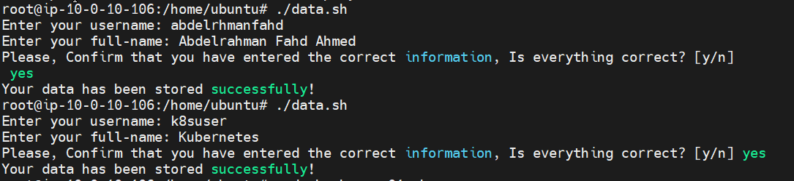
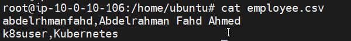
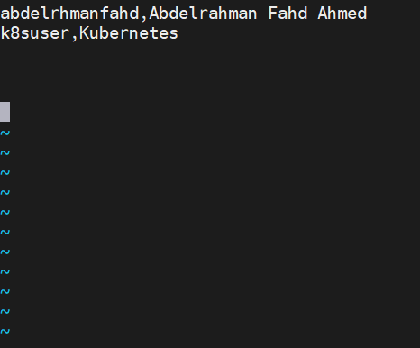
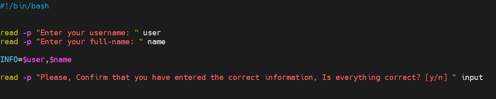
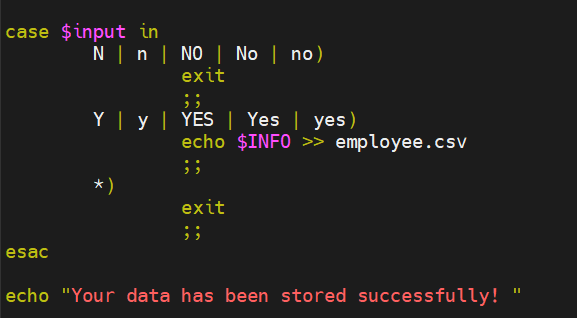
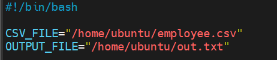
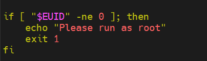
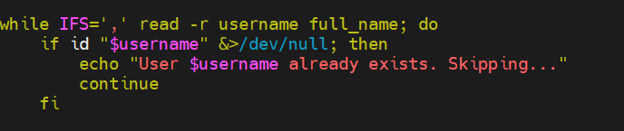
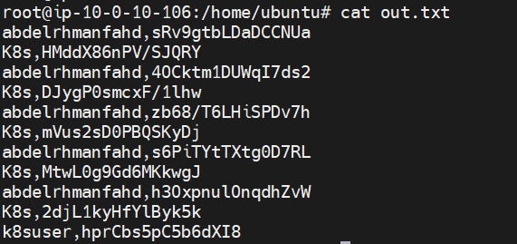

# 🧑‍💻 User Provisioning System

A Bash-based tool to automate the process of adding multiple Linux users from a CSV file with randomly generated passwords and first-login password resets.

---

## 📌 Features

- Add new users in bulk from a CSV file
- Auto-generate secure passwords using OpenSSL
- Force password change on first login
- Prevent duplication: skips already existing users
- Log all credentials in a separate output file
- Collect user data via terminal with confirmation
- Clean, modular Bash scripts

---

## 🛠 How It Works

This system includes two scripts:

### `data.sh` – Collect user info

```bash
read -p "Enter your username: " user
read -p "Enter your full-name: " name
...
echo $user,$name >> employee.csv
```

It takes a `username` and `full-name`, confirms the input, then appends the result to `employee.csv`.

---

### `user01.sh` – Process CSV and create users

```bash
if [ "$EUID" -ne 0 ]; then
  echo "Please run as root"
  exit 1
fi

while IFS=',' read -r username full_name; do
  ...
  password=$(openssl rand -base64 12)
  useradd -m -c "$full_name" "$username"
  echo "$username:$password" | chpasswd
  chage -d 0 "$username"
  echo "$username,$password" >> "$OUTPUT_FILE"
done < "$CSV_FILE"
```

This script reads each line from `employee.csv`, checks if the user exists, and if not:

- Creates the user
- Assigns a random password
- Logs the password in `out.txt`
- Forces the user to reset it on first login

---

## 🧪 Demo Screenshots

> Here's a step-by-step visual walk-through of the scripts in action.

### 1. Add user data to CSV



### 2. View the CSV file



### 3. Confirm the CSV contents via Vim



### 4. Take input and confirmation from the user



### 5. Handle random password generation and checking



### 6. Declare variables in the main script



### 7. Check if script runs as root



### 8. Verify if CSV file exists


### 9. Skip existing users



### 10. Generate random passwords


### 11. Attach password and force change on login


### 12. Log the result in a file



---

## 📂 Project Structure

```
user-provisioning-system/
│
├── data.sh                   # Script to collect user info
├── user01.sh                 # Script to create users
├── employee.csv              # (generated) List of users
├── out.txt                   # (generated) Log file of user-password pairs
├── README.md                 # This file
└── screenshots/              # Images for documentation
```

---

## 🚀 How to Use

```bash
# 1. Run the data collector
bash data.sh

# 2. Run the user creation script (as root)
sudo bash user01.sh
```

---

## 📜 License

This project is licensed under the [MIT License](LICENSE).

---

## Author

**Abdelrahman Fahd** – [GitHub](https://github.com/abdlrhmanfahd)
